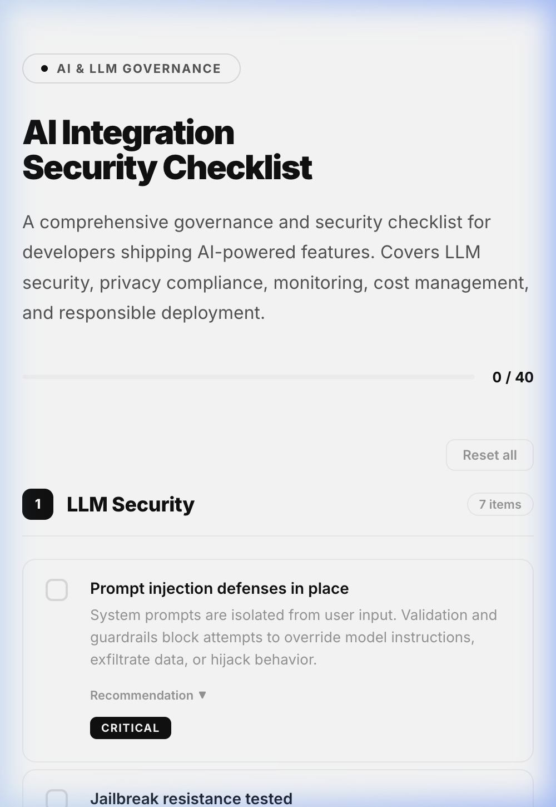
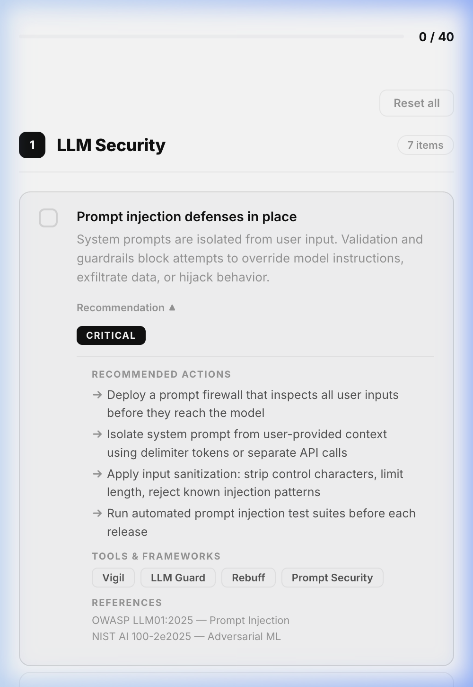

# AI-Check

**A security and governance checklist for AI and LLM integration.**

An open-source, interactive checklist that helps developers ship AI-powered features responsibly. Covers prompt security, data privacy, LLM monitoring, model governance, cost control, and regulatory compliance.

<p align="center">
  
  
</p>

---

## What This Is

A single-page reference for teams integrating Large Language Models (LLMs) into production applications. Each item describes **what** to check, **why** it matters, and its **severity** — from critical to low.

40 items across 8 categories:

```
 1  LLM Security                     7 items
 2  Privacy & Compliance             6 items
 3  Application Security             4 items
 4  Infrastructure & Operations      5 items
 5  LLM Monitoring & Observability   5 items
 6  Model Governance                 5 items
 7  Cost Management                  4 items
 8  UX & Responsible AI              4 items
```

## Use It

**→  [Open the interactive checklist](https://mhmdgazzar.github.io/AI-Check/checklist.html)**

Or clone it locally:

```bash
git clone https://github.com/mhmdgazzar/AI-Check.git
open AI-Check/checklist.html
```

Progress is saved to your browser's local storage. No server, no tracking, no dependencies.

---

## Why This Exists

Integrating LLMs into real products introduces risks that traditional security checklists don't cover — prompt injection, hallucination mitigation, model drift, token cost management, EU AI Act compliance. This checklist consolidates these concerns into one actionable document.

Built from real-world experience shipping LLM-powered features in production.

---

## Topics Covered

| Category | Key Areas |
|---|---|
| **LLM Security** | Prompt injection, jailbreak resistance, hallucination grounding, bias audits, content moderation, red-teaming |
| **Privacy & Compliance** | GDPR, sensitive data handling, EU AI Act, copyright, audit logging, data retention |
| **Application Security** | XSS on AI outputs, CSRF/SSRF, session management, input validation |
| **Infrastructure** | API key management, rate limiting, fallback strategy, vendor lock-in, IAM |
| **Monitoring** | Latency tracking, token usage, response quality scoring, drift detection, error tracking |
| **Model Governance** | Versioning, rollback plans, evaluation benchmarks, model cards, A/B testing |
| **Cost Management** | Budget caps, per-request token limits, cost attribution, optimization review |
| **Responsible AI** | Human escalation, AI disclosure, user feedback, accessibility |

---

## Contributing

Open an issue or PR if you'd like to add items, improve descriptions, or translate the checklist. Keep items concise — title + one-line rationale.

---

## License

[MIT](LICENSE)

---

<sub>Keywords: llm security checklist, ai governance framework, prompt injection prevention, responsible ai deployment, llm ops, ai safety audit, eu ai act compliance checklist, llm monitoring best practices, ai risk assessment, large language model security, generative ai governance, ai integration checklist, llm guardrails, ai compliance, machine learning operations security, chatbot security checklist, rag security, retrieval augmented generation safety, ai red teaming, model governance framework</sub>
